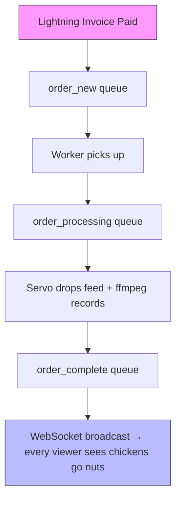

# ⚡ Pollofeed ⚡ 🐔😂
**Bitcoin Lightning-powered chicken feeder on Raspberry Pi**  
Real BTC payment → chickens get fed in <3 seconds. 100 % automated, zero disputes ever.

  

### Live demos
- https://www.youtube.com/watch?v=a0_dqDxx7Oo  
- https://www.youtube.com/watch?v=jXC39uCSrfA  

### Production RabbitMQ flow (async + live broadcast)


Queues: order_new → order_processing → order_complete
Tech stack
Scala • WebSockets • RabbitMQ • Bitcoin Lightning • Raspberry Pi • Arduino • Docker • Cloudflare • ffmpeg
Run locally (<5 min)
```
Bashcp example.env .env
npm install
npm run start:dev
```
